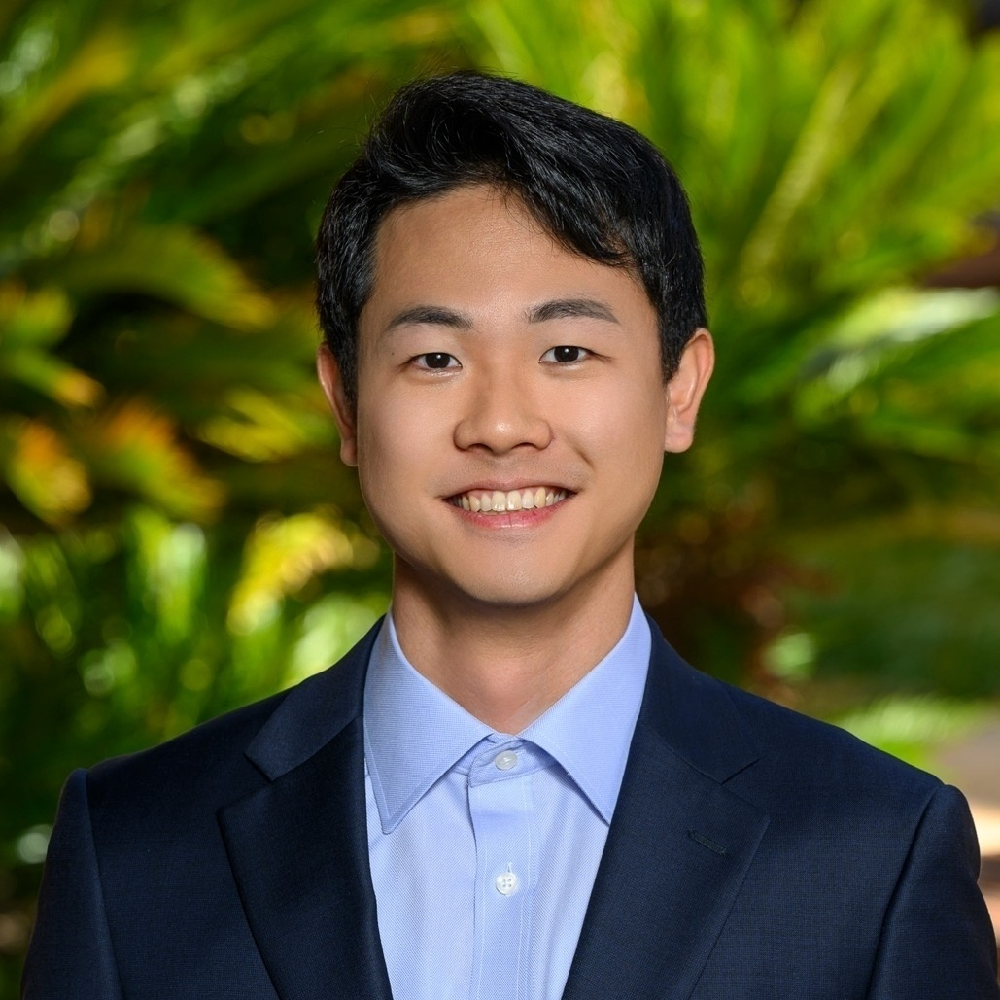

[Home](/) · [CV](cv.pdf) · [Research](/research) · [Teaching](/teaching) · [Writings](/writings) · [Contact](#contact)

---

# Eddie Jisang Yu, CPA

**JD/PhD Candidate in Accounting · Stanford University**  
Certified Public Accountant (Washington)

I study how regulation shapes financial reporting, disclosure, and market behavior.  
My research lies at the intersection of **securities law**, **information economics**, and **financial accounting**.

---

## Research

My research examines how legal and regulatory frictions interact with firms’ reporting incentives, and how these frictions shape capital market outcomes.

- *Working Paper Title* — with Coauthor(s). *(Abstract coming soon.)*
- Additional projects forthcoming.

For a full list of papers, see the [Research](/research) page.

---

## Teaching

I have assisted in courses covering financial accounting and regulatory regimes.  
Formal teaching responsibilities and materials will be posted here.

See the [Teaching](/teaching) page for updates.

---

## Credentials

- Certified Public Accountant — Washington State (Active)
- JD, Stanford Law School
- Ph.D. in Accounting, Stanford GSB
- MSc in Computer Science, University of Chicago
- Bachelor of Business Administration, Seoul National University

---
## Miscellaneous Writings

Occasional essays, notes, and practical advice about graduate school, the PhD process, academic workflow, and professional development.

- More posts coming soon...

See all posts on the [Writings](/writings) page.

---

## Contact

- Email: **jisangyu@stanford.edu**  
- GitHub: [github.com/eddie-jisang-yu](https://github.com/eddie-jisang-yu)  
- Website: **https://eddie-jisang-yu.github.io**

---
